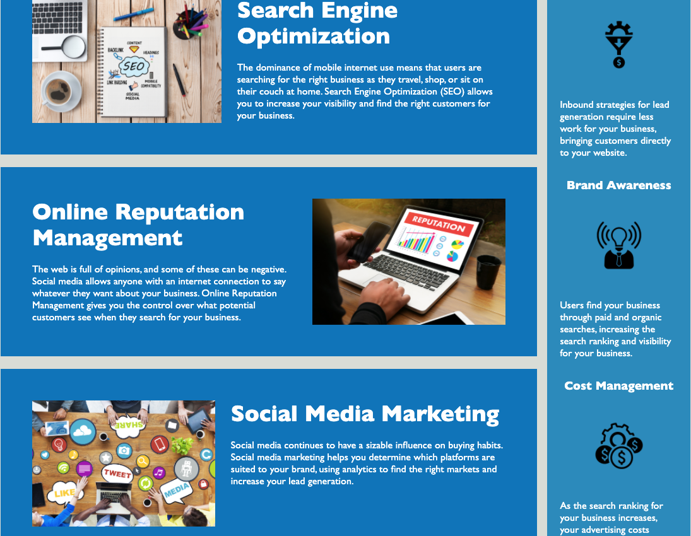

# horiseon-refactor

# <Your-Project-Title>

## Description

The motivation for this project was to first and foremost, refactor the code so that it is more accessible to those with disabilities while simultaneously optimizing search engine visibility by adding semantic elements. It was also to consolidate redundant code to increase performance of the application. While I working through the project I become more comfortable using different semantic elements and looking at code that is not mine. I also am realizing that there is more than one right answer even if you are structuring more basic HTML and CSS.

## Installation

- Go [HERE](https://github.com/PeterMoDavis/horiseon-refactor)
- Press the green Code button and copy the SSH.
- Open your Command Line and type "git clone 'paste-your-ssh-here'"
- Open the folder with your code editor.

## Usage

Click on the links in the top right corner of the header and you will be brought to the corresponding section in the main content.

## Credits

List your collaborators, if any, with links to their GitHub profiles.
If you used any third-party assets that require attribution, list the creators with links to their primary web presence in this section.
If you followed tutorials, include links to those here as well.

## License

## The last section of a high-quality README file is the license. This lets other developers know what they can and cannot do with your project. If you need help choosing a license, refer to [https://choosealicense.com/](https://choosealicense.com/).

🏆 The previous sections are the bare minimum, and your project will ultimately determine the content of this document. You might also want to consider adding the following sections.

## Badges

Badges aren't necessary, per se, but they demonstrate street cred. Badges let other developers know that you know what you're doing. Check out the badges hosted by [shields.io](https://shields.io/). You may not understand what they all represent now, but you will in time.

## Features

If your project has a lot of features, list them here.

## How to Contribute

If you created an application or package and would like other developers to contribute it, you can include guidelines for how to do so. The [Contributor Covenant](https://www.contributor-covenant.org/) is an industry standard, but you can always write your own if you'd prefer.

## Tests

Go the extra mile and write tests for your application. Then provide examples on how to run them here.
